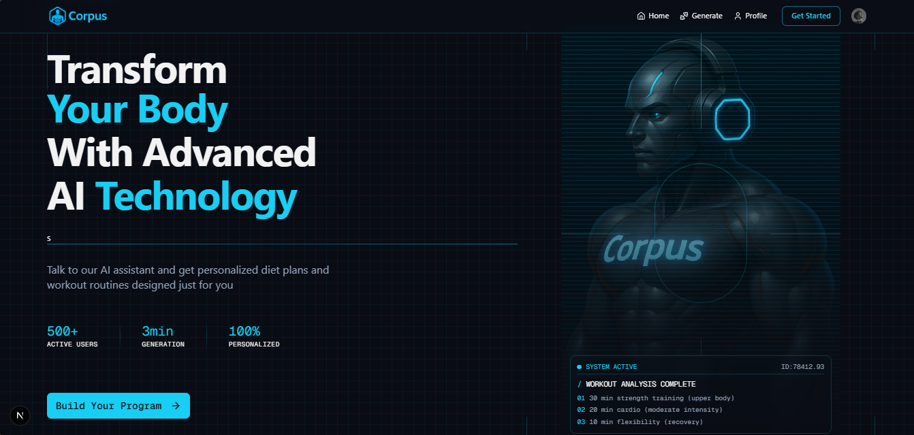
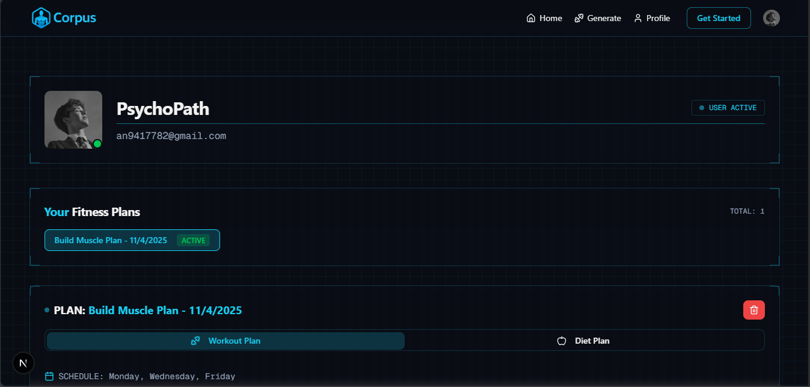
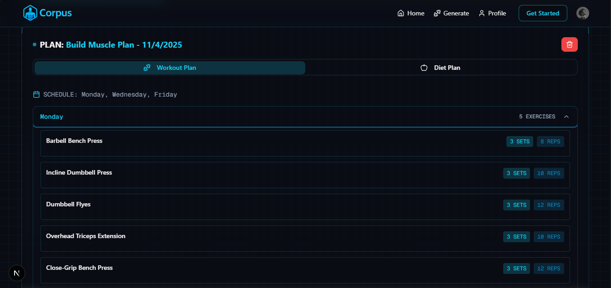
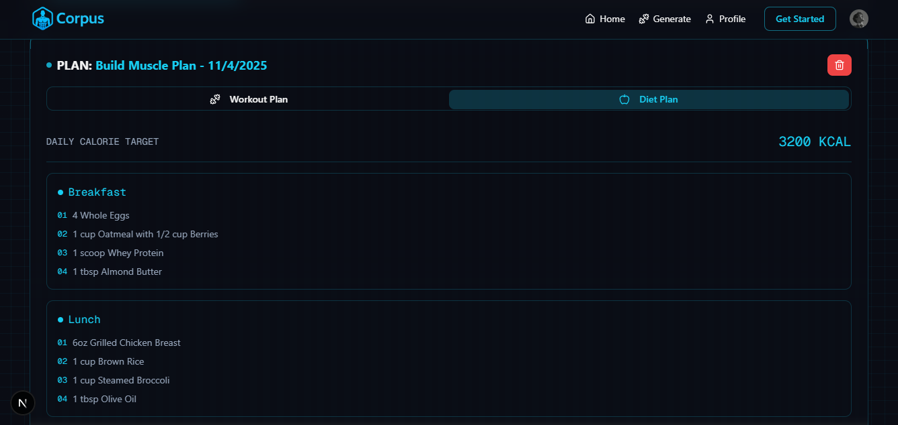
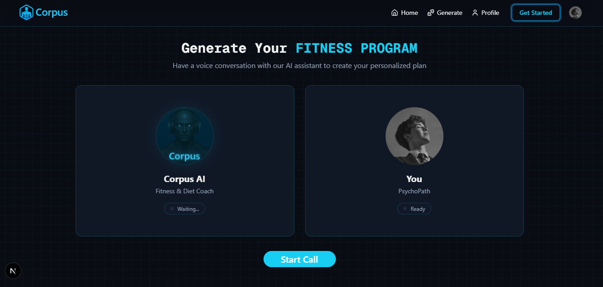

# 💪 Corpus AI: Personalized Fitness & Diet Coach



Corpus AI is a **modern, full-stack voice assistant application** designed to generate **hyper-personalized fitness and diet plans**.  
Users can either **chat with the AI** or use a **manual form** to provide biometrics and goals, which are then analyzed by our **Gemini-powered backend** to instantly generate structured fitness programs securely stored in their profile.

This project leverages a **Vapi Assistant + Convex Backend** architecture for real-time, reliable data flow and persistent user management.

---

## 🚀 Key Features

- 🎙️ **Conversational AI:**  
  Uses the **Vapi Assistant + Custom Tool** integration for reliable data collection and triggering backend actions.

- 🧠 **Gemini AI Integration:**  
  Leverages **Google’s Gemini API** (via Convex Actions) to analyze user input and produce structured fitness and nutrition plans.

- 🔒 **Secure Authentication:**  
  Powered by **Clerk** for seamless, secure sign-in and sign-up workflows.

- 💾 **Real-time Database:**  
  **Convex** provides a reactive, serverless backend where plans are saved instantly and synced live with user dashboards.

- 📱 **Responsive & Aesthetic UI:**  
  Built with **Next.js**, **Tailwind CSS**, and **Shadcn UI**, featuring a dark, cyberpunk-inspired theme optimized for all devices.

- 📝 **Manual Fallback:**  
  Allows users to bypass the voice assistant in case of network or microphone issues.

- 🗑️ **Program Management:**  
  Users can view, activate, or delete multiple generated plans using a clean custom UI dialog.

---

## 🛠️ Tech Stack

| Category | Technology | Purpose |
|-----------|-------------|----------|
| **Frontend** | Next.js / React | App routing, components, and client-side logic |
| **Styling** | Tailwind CSS / Shadcn UI | Responsive, utility-first styling with cyberpunk aesthetic |
| **Authentication** | Clerk | User authentication and route protection |
| **Voice Interface** | Vapi | WebRTC-based voice assistant for transcription and function calling |
| **Backend / DB** | Convex | Real-time database and secure backend with serverless actions |
| **AI / LLM** | Google Gemini API | Generates structured, intelligent fitness and diet plans |

---

## 🖼️ Application Screenshots

### 🏠 Landing Page
Modern, dark-themed interface with dynamic terminal-like visuals.  


---

### 👤 User Profile & Plan Overview
Secure user dashboard displaying active and historical fitness plans.  


---

### 🏋️ Generated Workout Plan
Structured weekly training schedules displayed in the **Workout Plan** tab.  


---

### 🍽️ Generated Diet Plan
Personalized calorie targets and meal recommendations via the **Diet Plan** tab.  


---

### 🗣️ Voice Assistant Interface
The main conversational interface for interactive fitness plan generation.  


---

## ⚙️ Setup & Installation

### **Prerequisites**
Ensure you have the following:

- Node.js (v18+)
- Clerk Account
- Convex Account
- Vapi Account (with Assistant configured to call `generate_plan`)
- Gemini API Key

---

### **1. Clone and Install**
```bash
git clone [https://github.com/mdafsar221b/corpus]
```
```bash
cd corpus
```
```bash
npm install
```
 #env.local (Demo)
 
```bash
# Clerk Authentication
NEXT_PUBLIC_CLERK_PUBLISHABLE_KEY=
CLERK_SECRET_KEY=

# Clerk Redirect URLs
NEXT_PUBLIC_CLERK_SIGN_IN_URL=/sign-in
NEXT_PUBLIC_CLERK_SIGN_UP_URL=/sign-up

# Convex Database
CONVEX_DEPLOYMENT=
NEXT_PUBLIC_CONVEX_URL=

# Vapi Voice AI
NEXT_PUBLIC_VAPI_WORKFLOW_ID=
NEXT_PUBLIC_VAPI_API_KEY=

# Gemini LLM Key
GEMINI_API_KEY=
```
In your **Vapi Dashboard**, set up the Assistant’s Custom Tool (`generate_plan`) as follows:

| Setting | Value |
|----------|--------|
| **Function Name** | generate_plan |
| **Server URL** | `https://[YOUR_CONVEX_URL]/vapi/generate-program` |
| **Async** | ON |
| **Strict** | ON |

---

### 5. Run the Application

```bash
npm run dev
```
